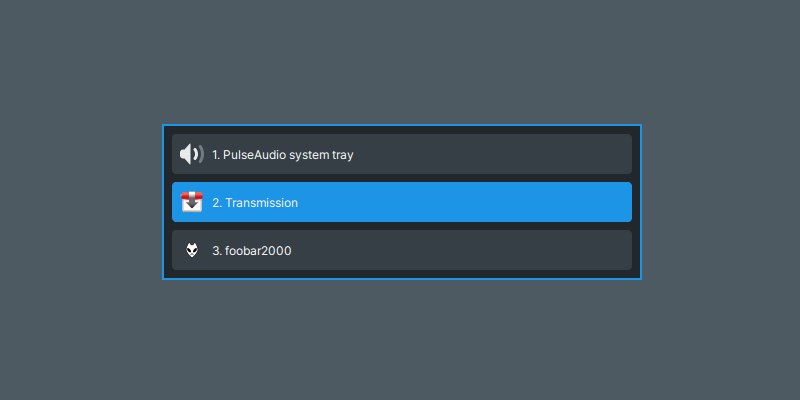

# GeekTray

GeekTray is a freedesktop.org system tray implementation for X11, but it provides a keyboard based UI that is unlike general system tray implementaions. So it has better interoperability with a tiling window manager.

## Features

- **Keyboard based UI**

    All of the features are accessible both from a mouse and a keyboard.

- **Fully customizable**

    All of the hotkeys and the UI styling are fully customizable by the configuration file.

- **Lightweight GUI implementation**

    GeekTray is a lightweight GUI implementaion written by Rust, which don't use any GUI toolkit such as GTK. There is only the dependencies of some low-level libraries.

## Requirements

- [XCB](https://xcb.freedesktop.org/)
- [xkbcommon](https://xkbcommon.org/) (with X11 support)
- [Pango](https://pango.gnome.org/) (1.57.0 or higher)
- [Cairo](https://www.cairographics.org/) (1.14 or higher)

## Installations

You can download the binary for Linux/amd64 from the [release page](https://github.com/emonkak/geektray/releases).

## Usage

GeekTray does not show any window on the screen when started for the first time. To show the window, you should use the hotkey for it (Default: <kbd>Super + Backquote(\`)</kbd>).

### Default Hotkeys

| Key                               | Command                           | Global |
| --------------------------------- | --------------------------------- | ------ |
| <kbd>Super + Backquote(\`)</kbd>  | Toggle window                     | ✅     |
| <kbd>q</kbd>                      | Hide window                       |        |
| <kbd>Escape</kbd>                 | Hide window                       |        |
| <kbd>1</kbd>                      | Select 1st item                   |        |
| <kbd>2</kbd>                      | Select 2nd item                   |        |
| <kbd>3</kbd>                      | Select 3rd item                   |        |
| <kbd>4</kbd>                      | Select 4st item                   |        |
| <kbd>5</kbd>                      | Select 5st item                   |        |
| <kbd>6</kbd>                      | Select 6st item                   |        |
| <kbd>7</kbd>                      | Select 7st item                   |        |
| <kbd>8</kbd>                      | Select 8st item                   |        |
| <kbd>9</kbd>                      | Select 9st item                   |        |
| <kbd>j</kbd>                      | Select next item                  |        |
| <kbd>Down</kbd>                   | Select next item                  |        |
| <kbd>Ctrl + n</kbd>               | Select next item                  |        |
| <kbd>k</kbd>                      | Select previous item              |        |
| <kbd>Up</kbd>                     | Select previous item              |        |
| <kbd>Ctrl + p</kbd>               | Select previous item              |        |
| <kbd>l</kbd>                      | Emit left click to selected item  |        |
| <kbd>Return</kbd>                 | Emit left click to selected item  |        |
| <kbd>h</kbd>                      | Emit right click to selected item |        |
| <kbd>Shift + Return</kbd>         | Emit right click to selected item |        |

## Configuration

You can customize the hotkeys and more by the configuration file. It is available in `$XDG_CONFIG_HOME/geektray/geektray.yml`. The configuration file is generated when GeekTray started for the first time.

## Known Bugs

### *A title is blank for Wine's application tray icons*

The tray icon window created by Wine isn't set a title. Additionally, The process that created window is not the application itself, but exeplorer.exe. So we can't get any information for the tray icon.

There is the [patch](https://gist.github.com/emonkak/1033cfc3f20bd435c5ac3c394205b2c9) for Wine to work-around this issue.

## FAQ

### *Is it supports freedesktop.org's StatusNotifierItem?*

No, because there are few applications using StatusNotifierItem at this time.
