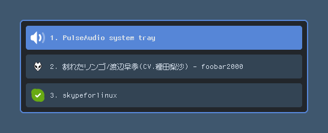

# GeekTray

GeekTray is a yet another freedesktop.org system tray implementation for X11. It provides a keyboard-oriented UI that is higher affinity for tiling window managers.

## Features

- **Keyboard-oriented UI**

    All of the actions are accessible both from a mouse and a keyboard.

- **Fully customizable**

    All of the key bindings and the UI styling are fully customizable by the configuration file.

- **Lightweight GUI implementation**

    GeekTray is a lightweight GUI implementaion written by Rust, which don't use any GUI toolkit such as GTK. There is only the dependencies of some low-level libraries.

## Requirements

- [XCB](https://xcb.freedesktop.org/)
- [xkbcommon](https://xkbcommon.org/) (with X11 support)
- [Pango](https://pango.gnome.org/) (1.57.0 or higher)
- [Cairo](https://www.cairographics.org/) (1.14 or higher)

## Installations

You can download the binary for Linux/amd64 from the [release page](https://github.com/emonkak/geektray/releases).

## Usage

GeekTray does not show any window on the screen when started for the first time. To show the window, you must use the key binding for it (Default: <kbd>Super</kbd> + <kbd>\`</kbd>).

### Default Hotkeys

| Key                                  | Action                            | Global |
| ------------------------------------ | --------------------------------- | ------ |
| <kbd>Super</kbd> + <kbd>\`</kbd>     | Toggle window                     | ✅     |
| <kbd>Q</kbd>                         | Hide window                       |        |
| <kbd>Escape</kbd>                    | Hide window                       |        |
| <kbd>1</kbd>                         | Select 1st item                   |        |
| <kbd>2</kbd>                         | Select 2nd item                   |        |
| <kbd>3</kbd>                         | Select 3rd item                   |        |
| <kbd>4</kbd>                         | Select 4st item                   |        |
| <kbd>5</kbd>                         | Select 5st item                   |        |
| <kbd>6</kbd>                         | Select 6st item                   |        |
| <kbd>7</kbd>                         | Select 7st item                   |        |
| <kbd>8</kbd>                         | Select 8st item                   |        |
| <kbd>9</kbd>                         | Select 9st item                   |        |
| <kbd>J</kbd>                         | Select next item                  |        |
| <kbd>Down</kbd>                      | Select next item                  |        |
| <kbd>Ctrl</kbd> + <kbd>N</kbd>       | Select next item                  |        |
| <kbd>K</kbd>                         | Select previous item              |        |
| <kbd>Up</kbd>                        | Select previous item              |        |
| <kbd>Ctrl</kbd> + <kbd>P</kbd>       | Select previous item              |        |
| <kbd>L</kbd>                         | Emit left click to selected item  |        |
| <kbd>Return</kbd>                    | Emit left click to selected item  |        |
| <kbd>H</kbd>                         | Emit right click to selected item |        |
| <kbd>Shift</kbd> + <kbd>Return</kbd> | Emit right click to selected item |        |

## Configuration

You can customize the key bindings and more by the configuration file. It is available in `$XDG_CONFIG_HOME/geektray/config.toml`. The configuration file is generated when geektray started for the first time.

## Known Bugs

### *A title is blank for Wine's application tray icons*

The tray icon window created by Wine isn't set a title. Additionally, The process that created window is not the application itself, but exeplorer.exe. So we can't get any information for the tray icon.

There is the [patch](https://github.com/emonkak/config/blob/master/gentoo/etc/portage/patches/app-emulation/wine-vanilla/systray-icon-title.patch) for Wine to work-around this issue.

## FAQ

### *Is it supports freedesktop.org's StatusNotifierItem?*

No, because there are few applications using StatusNotifierItem at this time.
